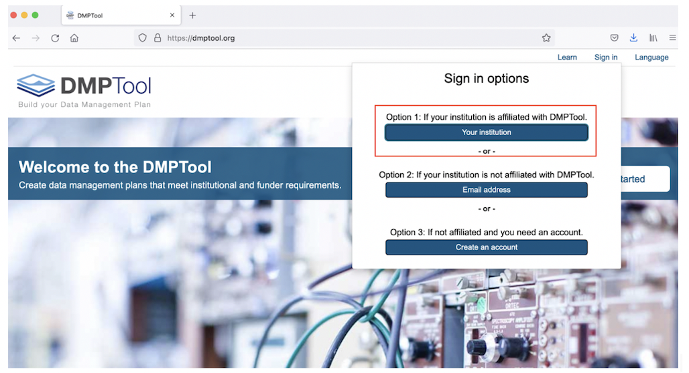
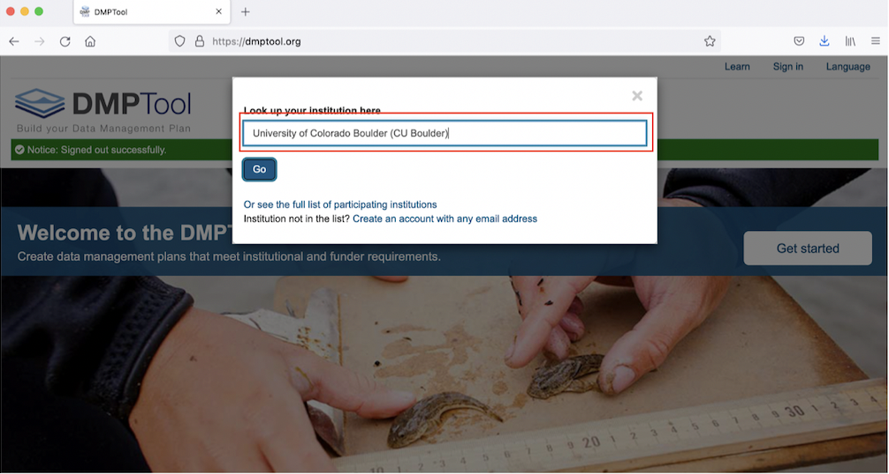
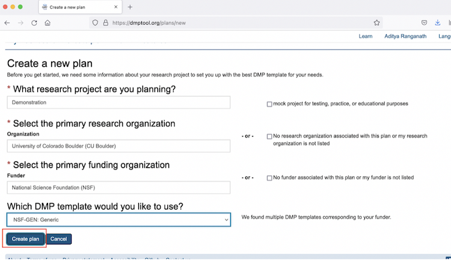
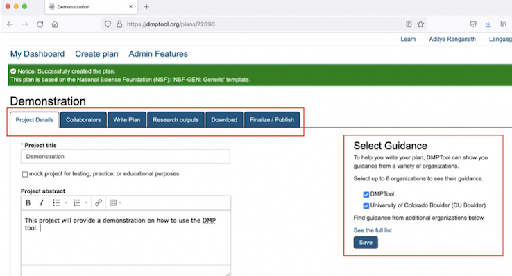
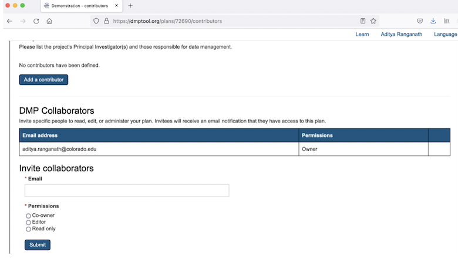
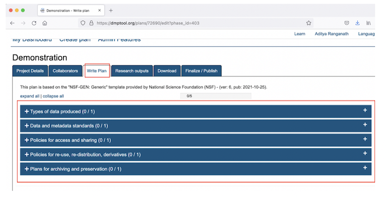
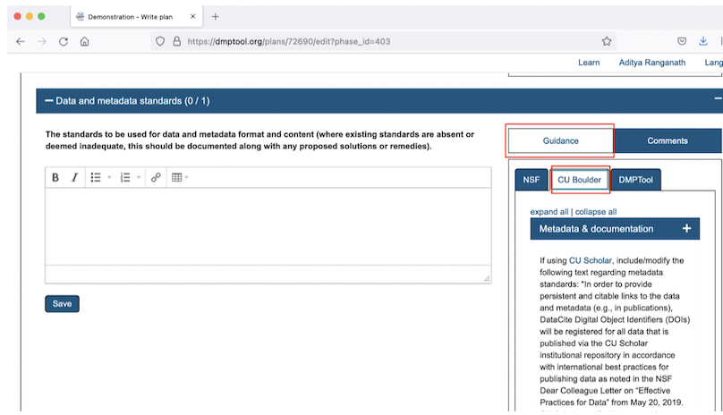
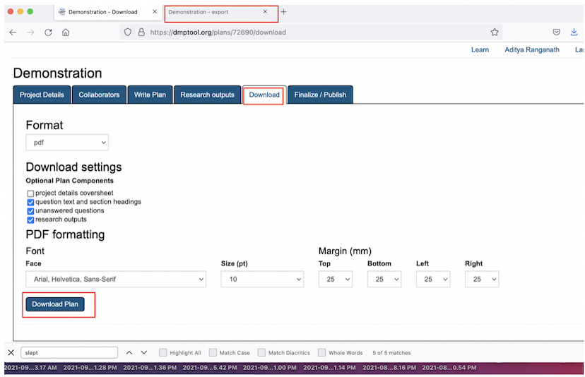
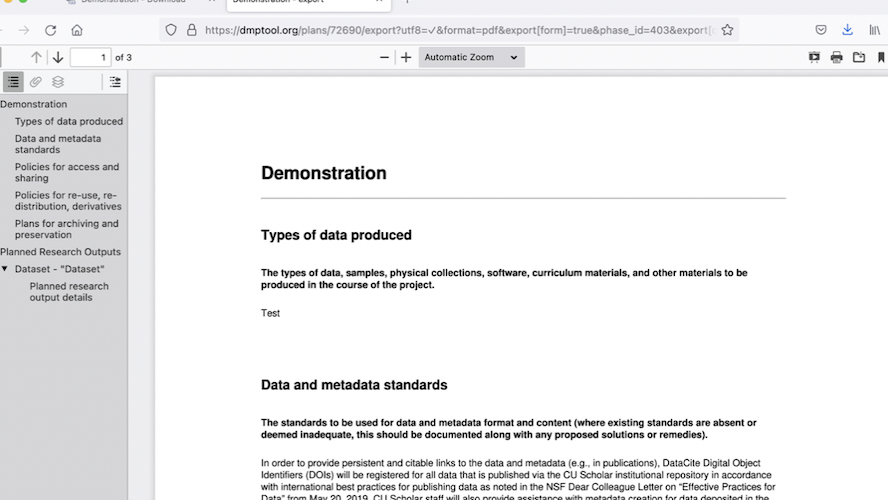
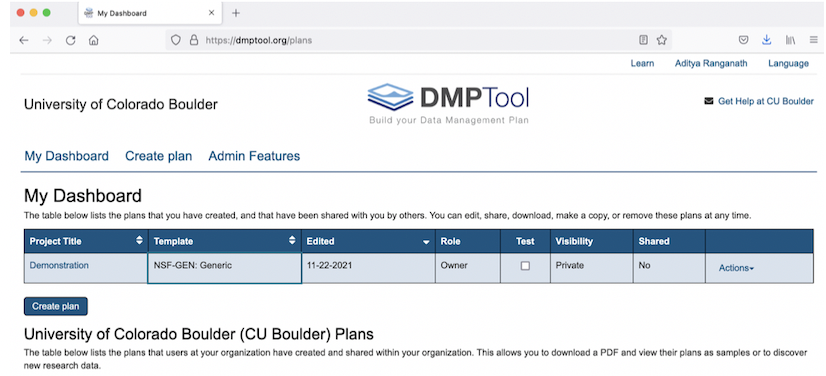

```{r setup, include=FALSE}
knitr::opts_chunk$set(echo = TRUE)
```

## A Guide to DMPTool for CU Boulder Researchers

### Step 1: Log into the DMPTool Account and Create a New Plan

Go to the [DMPTool](https://dmptool.org) website, and select the option to sign in via the institutional portal:

```{r, echo=FALSE}

```

Then, select University of Colorado, Boulder; once we click **Go**, we will be able to sign in via our Identikey:

```{r, echo=FALSE}

```

This will bring us to a menu where we can provide relevant details about our project (such as the project title and funding organization). Based on the funding organization we select, we can select the template that meets our needs from the drop-down menu below the section with the header that reads **Which DMP template would you like to use?** 

In this example, we’ll name our project “Demonstration”, since we’re creating this plan for demonstration purposes. We’ll pretend that the project is funded by the NSF, and that we’d like to work with the generic NSF template. Once we’ve made our selections, we can again select the **Create plan** button: 


```{r, echo=FALSE}

```

### Step 2: Customize, Write and Assemble the Data Management Plan

At this point, we are on a page that looks something like the one below. Within this environment, we can write and assemble our DMP. Note the blue buttons running along the top; to keep our workflow organized, we can systematically work through the sections that correspond with these various buttons. Also, note the **Select Guidance**  section on the right. Make sure that both the **DMPTool** and **University of Colorado Boulder (CU Boulder)** buttons are selected. This ensures that as we work through the material in the **Write Plan** tab, we will be able to see relevant guidance pertaining to different sections of the DMP. 


```{r, echo=FALSE}

```

The first button, **Collaborators**, will take us to a page where we can invite collaborators to participate in creating the DMP, and regulate their access to the DMP: 

```{r, echo=FALSE}

```

Once we’ve invited collaborators (if relevant) and set their permissions, we can click the **Write Plan** button, which will bring us to a page that looks like the one below. Each section on this page corresponds to a required section of the DMP (these sections are based on the template that was chosen earlier). Click the **+** to expand a section and work on it. 

```{r, echo=F}

```

To take an example, let’s expand the **Data and metadata standards** section, which will look like the image below once open. We can write (or paste) the text for this section into the text box, and click **Save** (note that it’s necessary to click Save after every section is completed). 

```{r, echo=F}

```

On the right of the image above, we can view relevant information on a section or advice on how to complete it. To view this information, make sure that the **Guidance** button is selected (when selected, it will appear white). Once the **Guidance** button is selected, we’ll see buttons corresponding to different sources. To see instructions from NSF or DMPTool itself, click on those buttons. To see CU Boulder-specific information on completing a given section (i.e. information on CU-specific resources or tools that might be relevant to a given section), click the **CU Boulder** button. There is CU Boulder-specific guidance for all sections in the **Write Plan** tab (assuming we’re using the generic NSF template) with the exception of the first section (on Types of Data). 

### Step 3: Download and Export the DMP

After completing and saving the various sections, we can click the **Download** button (next to the **Research outputs** button). After customizing the plan according to the desired specifications, we can then click **Download Plan**, at which point DMPTool will generate a complete data management plan in the desired file format (in this case, PDF), based on the text we entered in the various sections above.  

```{r, echo=F}

```

When opening up the exported file, it will look something like this:

```{r, echo=F}

```

### Step 4: Have someone review the draft DMP 

After generating a draft DMP using DMPTool, it is often useful to have someone review and offer feedback on your draft. In particular, we encourage CU researchers to reach out to the [Center for Research Data and Digital Scholarship](https://www.colorado.edu/crdds/), which has librarians who are able to review DMPs, and offer advice on possible revisions before submitting the plan to the granting agency. To set up an appointment with a CRDDS librarian, please send an email to [crdds@colorado.edu](mailto:crdds@colorado.edu). 

### Step 5: Revise the DMP

To implement revisions, we can access our DMP (and its various sections) from our personal DMPTool dashboard. Simply click on the relevant project title, and DMPTool will take us back into that project, where we implement necessary revisions to the relevant sections, and then re-export the revised DMP:

```{r, echo=F}

```

Note that it's not necessary to complete the DMP in one session; so long as we save the DMPTool sections as we go, it's always possible to return to an in-progress or incomplete DMP from our dashboard, and continue working where we left off. 


